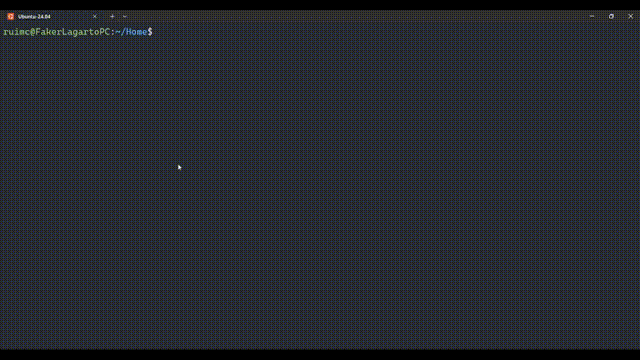

# Del-Tool-CLI

This project provides a command-line utility called `del` that allows you to delete files and folders directly from the terminal. It supports both single files and directories with content.

## 🎯 Why did I create this script?

On Ubuntu WSL, I was always using the command `rm -rf {name}`. To avoid repeating this command manually and to have clearer and more specific error messages, I created this simple and straightforward script to make the process easier and safer.

## 📂 Contents

- `del` — Python script that deletes files and folders.
- `install.sh` — Installation script that moves `del` to `/usr/local/bin`.
- `uninstall.sh` — Script that removes the `del` command from the system.

## ⚙️ Requirements

- Python 3 installed on the system.
- Permissions to use `sudo` (required to install the script in `/usr/local/bin`).

## 📦 Installation

1. Clone this repository.

2. Run the installation script:
```bash
bash install.sh
```
The script will:

- Check if Python 3 is installed.
- Check if the `del` file exists.
- Copy the `del` file to `/usr/local/bin/`.
- Make it globally executable.

## 🗑️ Uninstall

If you want to remove the `del` command from the system, run:
```bash
bash uninstall.sh
```

## 📷 Demo

<p align="center">
  
</p>

## ❗ Warning

This script deletes files and folders **permanently**, without sending them to the recycle bin/trash.<br>
**Use with